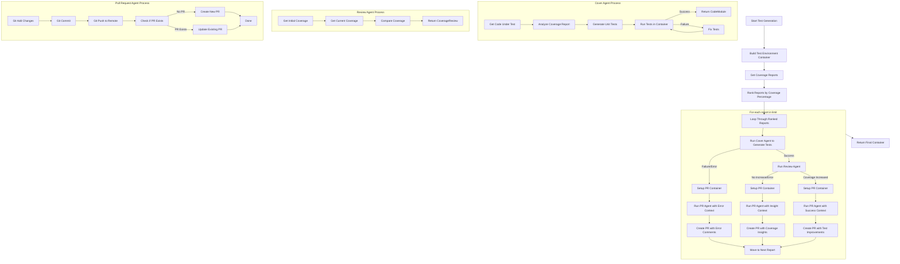

# DaggerRepo
<!--
<style>
    body { font-family: Arial, sans-serif; background-color: #0d1117; color: white; padding: 20px; }
    h1, h2, h3 { border-bottom: 1px solid #30363d; padding-bottom: 0.3em; }
    code { background-color: #161b22; padding: 0.2em 0.4em; border-radius: 4px; }
    pre { background-color: #161b22; padding: 1em; border-radius: 6px; overflow: auto; }
    a { color: #58a6ff; text-decoration: underline; }
    ul { list-style-type: disc; margin-left: 20px; }
    strong { font-weight: bold; }
</style>
-->

Cover.ai Test Bot

<br>

<div>
<h2>Prerequisites</h2>

1. Install Dagger.io (Instructions can be found <a href=https://docs.dagger.io/install/> here</a>)

</div>

<br>

<div>
    
<h2>Configuration</h2>

1. All repositories should be configured to run tests and generate coverage reports.

2. Configured to create an output file with the test results in JSON format or the format that the reporter plugin supports.

3. A Dockerfile should be present in the repository to run the tests.

4. Create a `config.yaml` file anywhere on desk with the following content:

This is a sample configuration file for our [Github-Dagger-Agent Repo]:
```
$schema: http://json-schema.org/draft-07/schema#

container:
    work_dir: "/app"
    docker_file_path: "./dockerfile"

core_api:
    model: "openai/gpt-4o"
    fallback_models:
        - "openai/gpt-4o"
        - "openai/gpt-3.5-turbo"

git:
    user_email: "AiTestGen@users.noreply.github.com"
    user_name: "Ai-TestGen[bot]"

reporter:
    name: "jest"
    command: "npm run test:coverage"
    output_path: "/app/coverage_reports/testResults.json"
    report_directory: "/app/coverage_reports"

test_generation:
    iterations: 1
    save_next_to_code_under_test: false
    test_directory: "tests"
    test_suffix: "test"
```
</div>

<h2>Usage</h2>

In order to see all functions available with these agents, type in the following command using Dagger: ``` dagger functions ```

If additional context is needed as to how a function may work and what the arguments need to be, type in the following command using Dagger: ``` dagger call [function name] --help ```
```
ARGUMENTS
      --branch string                 Branch to generate tests for [required]
      --github-access-token Secret    GitHub access token [required]
      --repository-url string         Repository URL to generate tests for [required]
      --logfire-access-token Secret   Logfire access token
      --model-name string             LLM model name (e.g., 'openai/gpt-4o', 'anthropic/claude-3.5-sonnet') (default "openai/gpt-4.1-nano")
      --open-router-api-key Secret    OpenRouter API key (required if provider is 'openrouter')
      --openai-api-key Secret         OpenAI API key (required if provider is 'openai')
      --provider string               LLM provider ('openrouter' or 'openai') (default "openrouter")
```
Here we pass the configuration file, a Github access token, a branch, an optional Logfire token, the model that you would like to use, either your OpenRouter API Key or your OpenAI API key, and the provider, which at the moment is either OpenRouter or OpenAI

<p> In order to generate a Github token, please visit <a href=https://docs.dagger.io/install/](https://github.com/settings/tokens>here</a> (Remember that your token is supposed to be a classic token). </p>
<p> If you choose to use OpenAI, in order to generate an OpenAI API key, you must create an OpenAI account and generate an API Key <a href="https://platform.openai.com/api-keys">here</a>. </p>
<p> If you choose to use OpenRouter, in order to generate an OpenRouter API key, create an OpenRouter account, and generate an API Key <a href="https://openrouter.ai/settings/keys">here</a>. </p>

An example of what a call to dagger using the REQUIRED arguments is:

``` bash
dagger call --config-file ./demo/agencyservices.yaml generate-unit-tests --github-access-token=env:GITHUB_TOKEN --repository-url https://github.com/Siafu/agencyservices-ai.git --open-router-api-key=env:OPEN_ROUTER_API_KEY --provider openrouter --branch feat/loveable-pairing --model-name x-ai/grok-3-mini-beta
```

Extensibility

Check [Reporter Interface] (insert here)
```
get-code-under-test    Extract code under test from the coverage HTML report
get-coverage-html      Get the coverage HTML file from the report file
get-coverage-reports   Extract coverage data from the HTML input and create a JSON file with the data
parse-test-results     Parse the test results JSON file and return a str with the failed tests
validate-config        Validate the configuration file
```

Jest implementation (insert info here)
```
dagger.json

{
  "name": "Reporter",
  "engineVersion": "v0.18.5",
  "sdk": {
    "source": "python"
  },
  "dependencies": [
    {
      "name": "JestReporterPlugin",
      "source": "jest"
    },
    {
      "name": "PytestReporterPlugin",
      "source": "pytest"
    }
  ]
}
```


